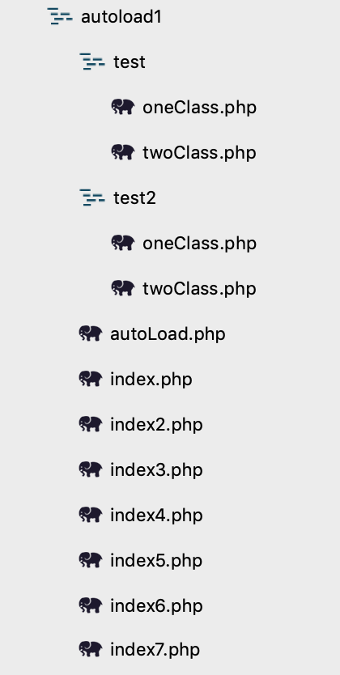

php高级知识点 
* [php自动加载](#php自动加载)
* [php反射](#php反射)
* php依赖注入
* PHP中间件
* jwt自定义实现
* jwt规范实现
* php7新特性
## php反射
---
```
<?php
/**
 *php反射机制使用场景
 *1.框架底层，比如tp框架底层的控制器调度
 *2.扩展功能
 *3.管理大量的未知类
 * 反射机制-基本使用
 * 1.使用反射机制查看类的结构
 * 2.使用反射机制实现代理调用（  这也是反射最核心的价值）
 */
class IndexAction{

    //方法执行行处理
    public function _before_index($param=''){
        echo __FUNCTION__."执行before_index方法".$param.PHP_EOL;
    }

    public function index(){
        echo "执行index方法".PHP_EOL;
    }

    public function test($year,$month,$day){
        echo $year.'---'.$month.'---'.$day.PHP_EOL;
    }

    //方法执行后处理
    public function _after_index(){
        echo __FUNCTION__.'执行after_index方法'.PHP_EOL;
    }

}

// $test =  new IndexAction();
// echo $test->test(12,2,3);

// //使用反射来代理调用
// //1.获取到类的反射对象
// $index_reflect_class = new ReflectionClass('IndexAction');

// //2.通过反射对象得到实例
// $index1 = $index_reflect_class->newInstance();
// //var_dump($index1);

// //3.获取反射方法的对象实例
// $show_method = $index_reflect_class->getMethod('showInfo');

// //4.通过反射方法调用showinfo
// $show_method->invoke($index1);


/*
 * php thinkphp控制器调度机制
 * 1.indexAction中的方法和访问修饰符是不确定的，如果是public可以执行
 * 2.如果存在_before_index方法，并且是public的，执行该方法
 * 3.再判断有没有_after_index方法，并且是public的，执行该方法
 */
$index_reflect_class = new ReflectionClass('IndexAction');
//通过反射取得实例对象
$controller = $index_reflect_class->newInstance();
//执行index方法
if($index_reflect_class->hasMethod('index')){
    $index_method = $index_reflect_class->getMethod('index');
    if($index_method->isPublic()){

        //先执行before_index，方法存在并public执行
        if($index_reflect_class->hasMethod('_before_index')){
            $before_index = $index_reflect_class->getMethod('_before_index');
            if($before_index->isPublic()){
                // $params = $before_index->getParameters();
                // print_r($params);
                //通过反射方法调用类实例对象
                $before_index->invoke($controller);
            }
        }

        //执行index方法
        $index_method->invoke($controller);
        //后执行after_index,方法存在并public执行
        if($index_reflect_class->hasMethod('_after_index')){
            $after_index = $index_reflect_class->getMethod('_after_index');
            if($after_index->isPublic()){
            //通过反射方法调用类实例对象
                $after_index->invoke($controller);
            }   
        }

    }else{
        echo "index不是公用方法不不执行".PHP_EOL;
    }
}else{
    echo "index 方法不存在不存在".PHP_EOL;
}

```

运行结果
```
_before_index执行before_index方法
执行index方法
_after_index执行after_index方法
```

## php自动加载
---
#### 下面显示例子的文件目录结构图

## 一、没有使用命名空间的几种实现
#### test/oneClass.php
```
class oneClass{

    public function show(){
        echo "这里是oneClass.php的show方法<br/>";
    }

}
```

#### test/twoClass.php
```
<?php

class twoClass{

    public function show(){
        echo "这里是twoClass.php的show方法<br/>";
    }

}
```

下面7种方式都可以实现自动加载，结果都为:
```
这里是oneClass.php的show方法
这里是twoClass.php的show方法
```

### 方法一：index.php 使用__autoload()魔术方法实现自动加载

```
<?php
//7.2以后使用这个提示一个警告,Deprecated: __autoload() is deprecated, use spl_autoload_register() instead
function __autoload($classname){
    include './test/'.$classname.'.php';
}

//调用类库如果找不到会自动执行__autoload()
$one = new oneClass();
$one->show();
$two = new twoClass();
$two->show();
```


#### 运行结果
```
Deprecated: __autoload() is deprecated, use spl_autoload_register() instead in /Users/lidong/Desktop/wwwroot/test/April/autoload1/index.php on line 5
这里是oneClass.php的show方法
这里是twoClass.php的show方法
```
#### 总结：在PHP7.2以后使用__autoload()会报一个警告，7.2之前这种方式是没提示的.这种方式，是调用一个找不到的类会自动取调用__autoload()方法然后在方法里面执行include引用，实现自动加载。

### 方法二：index2.php 使用spl_autoload_register()方法实现自动加载，创建自定义register方法调用
```
<?php

function register($classname){
    include "./test/{$classname}.php";
}

spl_autoload_register("register");

$one = new oneClass();
$one->show();
$two = new twoClass();
$two->show();
```

### 方法三：index3.php 使用spl_autoload_register()方法，不定义register方法直接使用回调
```
<?php

spl_autoload_register(function($classname){
    include "./test/{$classname}.php";
});

$one = new oneClass();
$one->show();
$two = new twoClass();
$two->show();
```

#### 方法四：index4.php 使用spl_autoload_register()方法，调用类的register方法实现自动加载
```
class autoLoad{
    public static function register($classname){
        include "./test/{$classname}.php";
    } 
}

spl_autoload_register(["autoLoad","register"]);

$one = new oneClass();
$one->show();
$two = new twoClass();
$two->show();
```

## 二、使用命名空间的几种实现
#### test2/oneClass.php
```
<?php

namespace auto\test2;
class oneClass{

    public function show(){
        echo "这里是oneClass.php的show方法<br/>";
    }

}
```

#### test2/twoClass.php
```
<?php
namespace auto\test2;
class twoClass{

    public function show(){
        echo "这里是twoClass.php的show方法<br/>";
    }

}
```

#### 方法五：index5.php，使用spl_autoload_register()，调用加载类的register方法，转化传递过来的命名空间实现自动加载
```
<?php

class autoLoad{
    public static function register($classname){
        $arr = explode('\\', $classname);
        include "./test2/{$arr[2]}.php";
    } 
}

spl_autoload_register(["autoLoad","register"]);

$one = new auto\test2\oneClass();
$one->show();
$two = new auto\test2\twoClass();
$two->show();
```

#### 方法六：index6.php 跟方法五类似，区别是use方法调用类实例化时可以直接使用类名，实现自动加载
```
<?php

use auto\test2\oneClass;
use auto\test2\twoClass;

class autoLoad{
    public static function register($classname){
        $arr = explode('\\', $classname);
        include "./test2/{$arr[2]}.php";
    } 
}

spl_autoload_register(["autoLoad","register"]);

$one = new oneClass();
$one->show();
$two = new twoClass();
$two->show();
```

#### 方法七：index7.php 与方法五和六思路一致，只不过加载类放在外部不是引用在统一文件，要点就是命名空间定义的类，要使用也要先include,实现自动加载
###### autoLoad.php
```
<?php

namespace auto;
class autoLoad{
    public static function register($classname){
        $arr = explode('\\', $classname);
        include "./test2/{$arr[2]}.php";
    } 
}
```
###### index7.php
```
<?php
use auto\test2\oneClass;
use auto\test2\twoClass;

include "./autoLoad.php";

spl_autoload_register(["auto\autoLoad","register"]);

$one = new oneClass();
$one->show();
$two = new twoClass();
$two->show();
```


### 总结：所有的自动加载思想都是调用一个没引用的类库后PHP会自动调用自动执行的一个方法，这个方法有可能是类的方法也有可能是普通方法，但不管怎么样都最终使用include执行文件包含，只不过命名空间需要转化下获取类名。另外值得注意的是，如果是一个php的框架自动加载实现也基本一致，只不过他会根据不同文件夹下面的定义判断后include来实现不同文件夹下文件的引用，来实现整个框架的自动加载。

