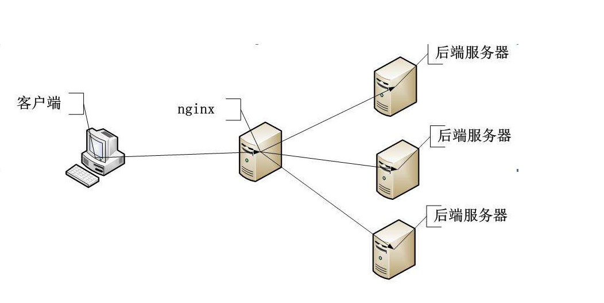

# nginx相关配置说明
- [nginx信号量](#nginx信号量)
- nginx虚拟主机配置
- [nginx方向代理](#nginx方向代理)
- [nginx实现负载均衡](#nginx实现负载均衡)

## nginx信号量
信号说明

| 信号名称 | 作用 |
| ------ | ------ |
| TERM,INT | 快速关闭 |
| QUIT | 从容关闭 |
| HUP | 重新加载配置，用新的配置开始新的工作进程，从容关闭旧的工作进程 |
| USR1 | 重新打开日志文件 |
| USR2 | 平滑升级可执行程序 |
| WINCH | 从容关闭工作进程 |

#### hup信号优雅重启
a.html
```
<html>
<h>这里是a.html文件</h>
<script>
window.location.href='./';
</script>
</html>
```
index.html
```
<html>
<h>这里是index.html文件</h>
<script>
window.location.href='./';
</script>
</html>
```


查看当前nginx的配置文件
```
server{
        listen 80;
        server_name localhost;
        root /Users/lidong/www;
        index  index.html index.htm;
        access_log /Users/lidong/wwwlogs/access.log;
        error_log /Users/lidong/wwwlogs/error.log;
}
```
修改nginx的配置文件，将nginx设置为默认读取a.html
```
server{
        listen 80;
        server_name localhost;
        root /Users/lidong/www;
        index a.html index.html index.htm;
        access_log /Users/lidong/wwwlogs/access.log;
        error_log /Users/lidong/wwwlogs/error.log;
}
```

```
ps aux|grep nginx
lidong            5019   0.0  0.0  4339176   1136   ??  S    11:16上午   0:00.01 nginx: worker process  
lidong             352   0.0  0.0  4339176   1480   ??  S    五08上午   0:00.05 nginx: master process /usr/local/opt/nginx/bin/nginx -g daemon off;  
lidong            5284   0.0  0.0  4277252    824 s000  S+    2:04下午   0:00.01 grep nginx
```
通过ps命令得到nginx的master进程id为352，通过hup信号重启配置
```
kill -HUP 352
```
打开浏览器不断观察发现使用信号HUP后会自动的跳转到a.html，我们并没有重启，而且发现不是立马的跳转是过几秒后跳转的，这就是优雅的重新读取nginx的配置文件，从容的关闭旧的进程。

#### USR1重读日志
```

server{
        listen 80;
        server_name localhost;
        root /Users/lidong/www;
        index  index.html index.htm;
        access_log /Users/lidong/wwwlogs/access.log;
        error_log /Users/lidong/wwwlogs/error.log;
}

```
##### 刷新http://localhost/index.html 页面
```

查看日志情况
QiongdeMacBook-Pro:wwwlogs lidong$ ls -l
total 80
-rw-r--r--  1 lidong  staff  16201  3 30 14:36 access.log
QiongdeMacBook-Pro:wwwlogs lidong$ mv access.log access.log.bak
QiongdeMacBook-Pro:wwwlogs lidong$ ls -l
total 88
-rw-r--r--  1 lidong  staff  16410  3 30 14:42 access.log.bak
```
从上面可以看出来虽然改变了log日志文件的名称，但是log日志还是在写入，出现这问题的原因linux中文件识别是以文件node的id来的。
##### 使用USR1信号用再次刷新
```
QiongdeMacBook-Pro:wwwlogs lidong$ kill -USR1 352
QiongdeMacBook-Pro:wwwlogs lidong$ ls -l
total 88
-rw-r--r--  1 lidong  staff      0  3 30 14:49 access.log
-rw-r--r--  1 lidong  staff  16410  3 30 14:42 access.log.bak
-rw-r--r--  1 lidong  staff    252  3 30 14:28 error.log
QiongdeMacBook-Pro:wwwlogs lidong$ ls -l
total 96
-rw-r--r--  1 lidong  staff    418  3 30 14:49 access.log
-rw-r--r--  1 lidong  staff  16410  3 30 14:42 access.log.bak
-rw-r--r--  1 lidong  staff    252  3 30 14:28 error.log
```
通过USR1型号量来重读日志，继续刷新页面，会重新生成access.log日志文件，这个对于运维做日志的备份十分有作用。
这里有个小技巧，通过ps获取pid可以重新加载配置文件，平滑重启服务，但是感觉比较麻烦，我们可以使用如下方法操作.
查看配置文件知道nginx的pid存储在那个文件
```
kill -HUP `cat /usr/local/etc/nginx/nginx.pid`
```

#### USR2平滑升级
假设我们重新编译了新的版本的nginx，这个时候/usr/local/nginx/bin nginx 的版本就不是之前的版本了如果启动更新会报错。
```
kill -USR2 `cat /usr/local/etc/nginx/nginx.pid`
```
这个时候使用这个命令来平滑升级nginx服务器

## nginx方向代理
跨域：浏览器从一个域名的网页去请求另一个域名的资源时，域名、端口、协议任一不同，都是跨域 。

下表格为前后端分离的域名，技术信息：

| 前后端 | 域名 | 服务器 | 使用技术 |
| ------ | ------ | ------ | ------ |
| 前端 | http://b.yynf.com | nginx | vue框架 |
| 后端 | http://api.yynf.com | nginx | php |


两种方式解决跨域的问题：

解决方法一：

在php入口index.php文件加入header头代码，允许访问解决了js调用api跨域的问题。

```
header("Access-Control-Allow-Origin: *");
header("Access-Control-Allow-Headers: Accept,Authorization,Cache-Control,Content-Type,DNT,If-Modified-Since,Keep-Alive,Origin,User-Agent,X-Mx-ReqToken,X-Requested-With,api-key");
header("Access-Control-Allow-Method: GET, POST, OPTIONS, HEAD");
header("Access-Control-Allow-Credentials: true");
```
 

解决方法二：

使用nginx的反向代理解决跨域：

api的nginx配置不需要改变只需要改变前端的服务器的nginx配置即可：
```
    location /apis {
            rewrite  ^.+apis/?(.*)$ /$1 break;
            include  uwsgi_params;
            proxy_pass  http://api.yynf.com;
    }
```
 
proxy_pass  url地址

让nginx监控/apis目录（这里自己定义只要跟nginx配置中保持一致即可），如果发现了这个目录就将所有请求代理到http://api.yynf.com这个请求中，当然也需要在js调用api的请求中多加一层请求结构：
前端代码中js请求地址
- 旧的js请求api的地址    http://api.yynf.com/badmin/user/add
- 新的js请求api的地址    http://api.yynf.com/apis/badmin/user/add

这样一来访问页面就会发现前端代码调用api地址都转向了http://api.yynf.com/apis/，利用将请求通过服务器内部代理实现了跨域问题。
代理解决跨域的优点：
- 1.有效的隐藏实际api的请求地址和服务器的ip地址
- 2.各司其职让前后端更方便管理，个自搭建自己的服务器保持一定的规范即可。

## nginx实现负载均衡
负载均衡：针对web负载均衡简单的说就是将请求通过负债均衡软件或者负载均衡器将流量分摊到其它服务器。
负载均衡的分类如下图：


今天分享一下nginx实现负载均衡的实现，操作很简单就是利用了nginx的反向代理和upstream实现：


| 服务器名称 | 地址 | 作用 |
| ------ | ------ | ------ |
| A服务器 | 192.168.0.212  | 负载均衡服务器 |
| B服务器 | 192.168.0.213  | 后端服务器 |
| C服务器 | 192.168.0.215  | 后端服务器 |


### A服务器nginx配置如下：
```
 1 upstream apiserver {  
 2     server 192.168.0.213:8081 weight=1 max_fails=2 fail_timeout=3;  
 3     server 192.168.0.215:8082 weight=1 max_fails=2 fail_timeout=3;  
 4 }  
 5 
 6 server {
 7     listen   80;
 8     server_name  api.test.com;
 9 
10     location / {
11         proxy_pass http://apiserver;
12         
13     }
14 
15     location ~ /\.ht {
16         deny all;
17     }
18 }
```

### B服务器配置如下：
```
 1 server {
 2     listen 8081;
 3     server_name 192.168.0.213;
 4     set $root_path '/data/wwwroot/Api/public/';
 5     root $root_path;
 6     index index.php index.html index.htm;
 7     access_log /data/wwwlogs/access_log/api.8081.log; 
 8     try_files $uri $uri/ @rewrite;
 9     location @rewrite {
10         rewrite ^/(.*)$ /index.php?_url=/$1;
11     }
12 
13     location ~ \.php {
14         fastcgi_pass   127.0.0.1:9000;
15         fastcgi_index index.php;
16         include /usr/local/nginx/conf/fastcgi_params;
17         fastcgi_param PHALCON_ENV dev;
18         fastcgi_split_path_info       ^(.+\.php)(/.+)$;
19         fastcgi_param PATH_INFO       $fastcgi_path_info;
20         fastcgi_param SCRIPT_FILENAME $document_root$fastcgi_script_name;
21     }
22 }
```

### C服务器配置如下：

```
server {
    listen 8082;
    server_name 192.168.0.215;
    set $root_path '/data/wwwroot/Api/public/';
    root $root_path;
    index index.php index.html index.htm;
    access_log /data/wwwlogs/access_log/api.8081.log; 
    try_files $uri $uri/ @rewrite;
    location @rewrite {
        rewrite ^/(.*)$ /index.php?_url=/$1;
    }

    location ~ \.php {
        fastcgi_pass   127.0.0.1:9000;
        fastcgi_index index.php;
        include /usr/local/nginx/conf/fastcgi_params;
        fastcgi_param PHALCON_ENV dev;
        fastcgi_split_path_info       ^(.+\.php)(/.+)$;
        fastcgi_param PATH_INFO       $fastcgi_path_info;
        fastcgi_param SCRIPT_FILENAME $document_root$fastcgi_script_name;
    }
}
```
 

到期负载均衡搭建完成，测试的可以访问搭建的域名地址，然后在对应的后端服务器打印access的log日志进行查看请求是否在轮询服务器。

思考：负载均衡搭建是搭建成功了，但是也有问题
- 1.这样的架构会出现session无法共享的问题？
- 2.如果其中有一台后端服务器宕机了怎么处理？
这些问题后面会有文章进行说明

